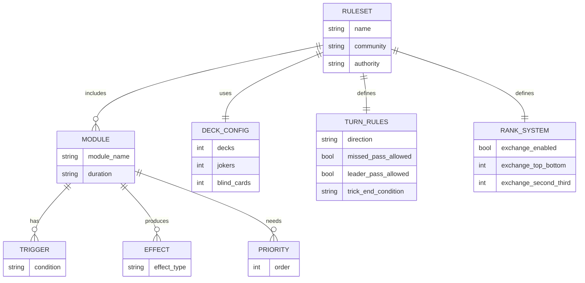
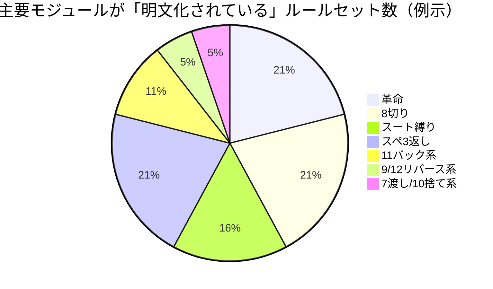

# 大富豪のルール変種総覧と統一ルール提案

## エグゼクティブサマリー

日本の「大富豪／大貧民」は、**基本骨格（カードを強さ順に出し切る“クライミング”系）**が共通でも、**「パスの扱い」「場が流れる条件」「特殊効果の優先順位」「上がり（フィニッシュ）可否」「席替え・献上（交換）」**などの差が、実プレイの体験を根本から変えるほど大きいゲームです。各地のローカルルールが非常に多いことは、アンケート調査やメディア取材でも繰り返し指摘されています。citeturn35view2turn35view1

公開されている「ルールセット（まとまった規定）」として特に影響力が大きいのは、次の3系統です。  
第一に、競技用としてルールを公開し、複数ゲーム／セット／マッチといった大会運用まで含めて規定する**連盟公式ルール**（五大公式ルール＋反則あがり等）です。citeturn5view0turn5view1turn5view2turn36search0  
第二に、コンピュータ対戦（研究・競技）向けに、役の種類や場の流れ、しばり、8切り、革命などを厳密に定義した**UEC標準ルール系**です（5人・53枚・空場パス可など、一般の卓と違う点がはっきりあります）。citeturn24view0turn23view1  
第三に、多数のローカルルールを「設定項目」として実装し、ユーザーが組み合わせることを前提にした**アプリ／オンライン実装系**（例：50以上のローカルルールを列挙し、開始札・ジョーカー枚数・縛りの形・9/12リバース等までカスタム可能）です。citeturn32view0turn31view0turn33view0

本レポートは、「世界中／日本中の全てのハウスルール」を文字通り“完全に”列挙することは原理的に不可能（発生源が無数で、新規ルールが作られ続ける）である点を明示した上で、**一次ソース（公式ルール、公式プレイガイド、運営ブログ、研究報告）を優先**し、そこに載る「変種」を“取りこぼしにくい形”で整理できるよう、  
- 変種を記述するための**属性（データモデル）**  
- 代表的ルールセットの**比較表**  
- ルールセット別の**詳細仕様**  
- ルール間の**衝突（優先順位・解釈差）**と互換性  
- 実務上使える**統一標準ルール案**  
- 用語集・索引  
を提示します。citeturn13search14turn35view2turn35view1

## 研究方法と限界

参照した一次・準一次資料の中心は、競技団体が公開する公式ルール（大会運用を含む）、オンラインゲームの公式プレイガイド、運営公式ブログ、学術系の標準ルール記述（研究報告・講演資料）です。citeturn5view0turn5view1turn5view2turn31view0turn33view0turn24view0turn23view1  
加えて、ルール衝突（例：同時発動の解決順）の「標準不在」問題を明示する資料として百科事典的記述、またローカルルールの分布と呼称差（地域・年代差）を示す調査記事・アンケート記事も用いました。citeturn13search14turn35view2turn34view0turn35view1

ただし、ユーザー要望にある「ローカル／ハウスルールの完全網羅（no omissions）」は、次の理由で厳密には達成できません。  
- ローカルルールは“口承＋その場合意”で増殖し、**公開記録がないまま消える／変化する**ものが多い。citeturn35view2  
- 同名ルールが地域・卓で別効果を持つ（例：「都落ち」の定義差、10系効果のバリエーション）。citeturn34view0turn35view2turn31view0  
- 複数効果が同時に起きた際の**処理順（裁定）に普遍的正解がない**ケースがある（アプリ実装では開発者裁量になりがち）。citeturn13search14  

そこで本稿は、「リストの長さ」で戦うのではなく、**どんな未知ルールが来ても“同じ枠組みで記述・比較・衝突検出できる”**ように、属性設計と互換性整理を主軸にします。citeturn35view1turn13search14

## ルール変種を記述するためのデータモデル

大富豪の変種を“漏れなく記述する”ためには、ルール名の羅列よりも、以下のような**次元（ディメンション）**を固定して記録するのが有効です。UEC標準ルール系の文書は、役（単体・グループ・階段）、場の流れ、革命、縛り、8切り、ジョーカーの扱い等を箇条書きで厳密に定義しており、ここから重要属性を抽出できます。citeturn24view0turn23view1

### 推奨属性一覧（記録テンプレートの要点）

| 属性カテゴリ | 具体項目（例） | なぜ必須か |
|---|---|---|
| メタ情報 | ルールセット名／別名、地域・コミュニティ、運用目的（家庭・競技・アプリ等）、出典URL、改定日、裁定方式（人間／実装） | 同名異ルール・世代差が多く、出典がないと比較不能。citeturn35view2turn35view1 |
| デッキ構成 | 1デッキ/複数デッキ、ジョーカー枚数（0–2等）、ブラインド（抜き札）枚数、特殊カード（独自カード） | ジョーカー枚数や抜き札が手札枚数と確率を変える。連盟公式はブラインドカードを採用。citeturn5view0turn13search10turn31view0 |
| 人数・席 | 推奨人数、欠員時の扱い（NPC等）、席順固定/入替、配り方（誰が配るか、方向） | 席替え・役割（配り手）・献上が公平性と戦略に直結。citeturn5view0turn36search0turn24view0turn31view0 |
| 札の強さ | 通常時の順位、革命時の順位、ジョーカーの相対位置（常に最強か、代用時の扱い）、スートの順位（同値タイブレーク用） | 「革命」「11バック」等は強さ反転を起こす。citeturn5view2turn31view0turn33view0turn24view0 |
| 役（合法な出し方） | 単体、同数グループ（2–4枚等）、階段（同スート連番、最小枚数）、ワイルド混入可否、同値レイズ可否 | “階段あり/なし”だけで難度が別ゲーム級に変化。citeturn31view0turn33view0turn24view0turn23view1 |
| ビート規則 | 同種・同枚数でのみ上書きか、階段の比較方法、縛り中のスート構成一致ルール | しばりは「スート一致」をどう定義するかで衝突が多い。citeturn24view0turn5view2turn12search9 |
| ターン進行 | 時計回り/反時計回り、リバースの仕様（永続/一時）、パスの扱い（見逃しパス可否）、空場パス可否、流れ条件（全員パス／他条件） | “一度パスしたらその場では出せない”かどうかでルール解釈が割れる。citeturn36search0turn36search4turn24view0turn31view0 |
| 特殊効果 | 8切り、革命、11バック、都落ち、スペ3返し、数字別効果（5スキップ、7渡し/パサー、10捨て/ステ、Qボンバー等）、発動条件・持続・優先順位 | 複数同時発動の処理順が最大の不確実性。citeturn13search14turn31view0turn32view0 |
| 階級と献上 | 階級の種類（大富豪〜大貧民等）、次ゲームの交換枚数、上位が渡す札の選択権、下位が渡す札の強制（最強） | 交換ルールが“固定化”を生むため、多くのローカルルールはバランス補正として発生している。citeturn12search11turn33view0turn31view0turn5view1turn24view0 |
| 禁止・罰則 | 反則あがり（禁止上がり）の対象、発生時の処理（即最下位等）、都落ちとの競合、離脱時の扱い | 競技系は反則処理を明示する傾向。citeturn5view2turn31view0turn33view0 |
| 得点と終了 | 1ゲームの配点、セット/マッチ方式、同点タイブレーク、何ゲームで終了か | 競技運用（繰り返し試合）と家庭運用（1回勝負）を分けて記述すべき。citeturn5view0turn35view1turn24view0turn31view0 |

### 記録用JSONスキーマ例

```json
{
  "variant_name": "",
  "aliases": [],
  "region_or_community": "",
  "authority_and_source": {
    "type": "official|tournament|app|research|community",
    "citation_url": ""
  },
  "deck": {
    "num_decks": 1,
    "jokers": 1,
    "blind_cards": 0,
    "additional_special_cards": []
  },
  "players": {
    "min": 3,
    "max": 6,
    "default": 4,
    "seating_rule": "",
    "dealer_rule": ""
  },
  "rank_order": {
    "normal": ["Joker", "2", "A", "K", "Q", "J", "10", "...", "3"],
    "revolution": ["Joker", "3", "4", "...", "2"],
    "joker_as_wild": true,
    "suit_tiebreak_order": null
  },
  "legal_plays": {
    "single": true,
    "group": {"min_size": 2, "max_size": 4, "joker_substitution": true},
    "sequence": {"enabled": true, "min_len": 3, "same_suit_required": true, "joker_substitution": true}
  },
  "turns": {
    "direction": "clockwise",
    "reverse_rule": {"enabled": false, "trigger": null, "duration": null},
    "pass": {"allowed": true, "missed_pass_allowed": false, "leader_pass_allowed": false},
    "trick_end": {"by_all_pass": true, "special_clear_triggers": []}
  },
  "special_rules": [],
  "rank_privileges": {"exchange": {"enabled": true, "mapping": []}},
  "penalties": {"foul_finish": {"enabled": false, "forbidden_cards": []}},
  "scoring": {"per_game_points": [], "match_structure": ""},
  "tie_breakers": []
}
```

## 主要ルールセット比較表

以下は、「1つの文書・実装としてまとまっており」「出典が追跡できる」代表ルールセットを、上の属性次元で比較したマスター表です（表の“特殊効果”は代表例のみを短縮記載）。  
なお、同一名称でも設定で変わる実装（ルールカスタム型）は、**“実装が提供する選択肢の上限”**を記します。citeturn32view0turn31view0turn33view0

| ルールセット | コミュニティ/権威 | デッキ | 人数 | 開始親 | パス再参加 | 流れ条件 | 主要な役 | 主要な特殊効果 | 反則あがり/罰則 | 得点・終了 |
|---|---|---:|---:|---|---|---|---|---|---|---|
| entity["organization","日本大富豪連盟","japan daifugo federation"] 連盟公式ルール | 競技団体の公開ルール citeturn5view0turn5view2turn35view1 | 54枚（ジョーカー2＋ブラインド2で配札は常に13枚） citeturn5view0turn13search10 | 主に4人（3人制規定あり） citeturn5view0turn5view1 | セット第1ゲームは♠（席決め） citeturn5view0turn36search0 | 不可（見逃しパス禁止） citeturn36search0 | 他全員パス＋特殊流し（8切り等） citeturn5view1turn5view2turn36search0 | 単体/同数複数枚/階段 citeturn5view1turn5view2 | 革命・8切り・都落ち・スート縛り・スペ3返し citeturn5view2turn35view1 | 反則あがり規定あり（2/8/Joker/♠3等条件） citeturn5view2turn36search0 | 4ゲーム=1セット、3セット=1マッチ、順位点＋ボーナス citeturn5view0turn35view1 |
| UEC標準ルール系（研究・競技） | entity["organization","電気通信大学","public university, japan"] 系資料に基づく標準化 citeturn24view0turn23view1 | 53枚（ジョーカー1） citeturn24view0turn23view1 | 5人 citeturn24view0turn23view1 | ♦3所持者開始（資料） citeturn23view1 | 不可（パス永続）・空場パス可 citeturn23view1turn24view0 | 未上がり全員パス、8切り等 citeturn24view0turn23view1 | 単体/グループ/階段 citeturn24view0turn23view1 | 革命（4+グループ、5+階段）、スートしばり、8切り、スペ3返し citeturn24view0turn23view1 | 上がり制限は資料により“任意”とされる例あり citeturn23view1 | 多数ゲーム反復を前提（研究報告） citeturn23view1turn24view0 |
| entity["video_game","ドラゴンクエストX","mmorpg, square enix"] 公式プレイガイド | 公式ガイド（固定ルール＋カスタム） citeturn31view0 | 53枚（Joker1、設定で2） citeturn31view0 | 基本4人（不足はNPC） citeturn31view0 | 1ゲーム目は♦3所持者、以降は大貧民 citeturn31view0 | 不明確（通常は周回で出せる想定）だが、場流れは「最後に出した人に戻る」型 citeturn31view0 | パスが回って最後に出した人へ戻ると流れ citeturn31view0 | 単体/同数複数枚/階段 citeturn31view0 | 反則あがり、都落ち、革命、階段、8斬り、しばり、数しば、スペ3返し、5スキップ、9リバース（永続）、11バック（一時）、7パサー、10ステ、Qボンバー等 citeturn31view0turn13search7 | 反則あがりは最下位化＋場流し等 citeturn31view0 | 最大4ゲーム、勝ち点最多で順位 citeturn31view0 |
| entity["video_game","大富豪ONLINE","mobile app, sorairo"] | 公式サイトが“50以上のローカルルール”を設定項目として列挙 citeturn32view0turn32view1 | Joker0–2など設定 citeturn32view0turn32view1 | 最大5人 citeturn32view0 | 開始札（♠3/♣3/♥3/♦3/大貧民）など選択 citeturn32view0 | 「パス制限」設定あり citeturn32view0 | 設定依存 citeturn32view0 | 階段枚数・強さ・エンペラー等まで設定 citeturn32view0 | 革命系（階段革命・革命選択・オーメン等）、縛り系（激しば/片しば/数縛り等）、8切り対抗（4止め等）、11バック強化、各種上がり禁止、9/12リバース、5/13スキップ、7渡し、10捨て、天変地異、都落ち、下克上 等 citeturn32view0 | 各種“○○あがり禁止”設定 citeturn32view0 | ルールマッチング・カスタムルール保存 citeturn32view0turn32view1 |
| entity["video_game","アメーバピグ","virtual world, cyberagent"] 大富豪 | 運営が部屋ごとに固定ルールを告知 citeturn33view0 | 記載範囲では通常トランプ＋Joker想定 citeturn33view0 | 4人 citeturn33view0 | 1戦目♦3、以降大貧民 citeturn33view0 | 記載あり（一般の進行） citeturn33view0 | 記載あり citeturn33view0 | 階段あり、革命は同数4枚または同スート連番4枚以上（階段革命） citeturn33view0 | 部屋により、8切り・しばり・11バックが追加 citeturn33view0 | 反則あがり（2/革命中3/Joker、部屋により8・11も） citeturn33view0 | 交換規定固定（上位任意、下位は最強を自動献上） citeturn33view0 |
| entity["organization","Yahoo!モバゲー","japanese online game portal"] の大富豪説明 | ポータルのゲーム説明 citeturn36search19 | 54枚（Joker2） citeturn36search19 | 4人 citeturn36search19 | ♦3所持者（親）、初手は“好きなカード” citeturn36search19 | 不明（記述は一般型） citeturn36search19 | “最後にカードを出した人以外全員パス”で流れ citeturn36search19 | 単体＋同数複数枚 citeturn36search19 | （ページ範囲では）基本中心 citeturn36search19 | 記載なし citeturn36search19 | 称号付与（大富豪/富豪/貧民/大貧民） citeturn36search19 |
| entity["organization","playingcards.jp","japanese card rules site"] の説明 | ルール解説サイト citeturn36search1 | 53枚（Joker1） citeturn36search1turn11search2 | 4～8人 citeturn36search1 | ♦3所持者など citeturn11search2 | 再参加可の説明になっている（“最初にパスした人に戻ると流れ”） citeturn36search1 | 全員パスで流れ citeturn36search1 | 単体/同数複数枚 citeturn11search2turn36search1 | ジョーカーの代用・縛り等に言及 citeturn11search2 | 記載範囲では一般説明 citeturn11search2 | 記載範囲では一般説明 citeturn11search2 |
| 学校イベント／大会ルールブック例 | 4人卓・複数ゲーム・ポイント制の明示 citeturn36search3turn9search9 | Joker併用、複数枚にJoker可 citeturn36search3 | 4人 citeturn36search3 | 記載あり（一般型） citeturn36search3 | 不明 citeturn36search3 | “自分以外全員パス”で流れ citeturn36search3 | 単体/同数複数枚/階段等 citeturn9search9 | “6大ルール”として8切り・都落ち・Jバック・縛り等 citeturn9search9turn36search3 | 反則あがり規定あり citeturn9search9 | 大富豪3P等の配点 citeturn36search3 |
| entity["video_game","世界のアソビ大全51","switch, nintendo 2020"] | entity["company","任天堂","video game company, japan"] の収録ゲームとしての実装 citeturn9search8turn10search6 | （実装依存） citeturn10search2 | 1〜4人（収録情報） citeturn9search8 | 設定可能ルールが限られる旨の言及あり citeturn10search2 | 不明 citeturn10search2 | 不明 citeturn10search2 | 不明 citeturn10search2 | 8切り・スペ3返し・しばり・都落ち等の設定があるとされる citeturn10search2 | “反則あがり”設定が限定的との指摘 citeturn10search2 | 5/10ラウンド等の言及 citeturn10search2 |

## ルールセット別の詳細

ここでは、上表の各ルールセットを「カードの強さ」「役」「進行」「特殊効果」「献上」「罰則」「得点」の順に、実務的に再現できる粒度でまとめます（同じ概念でも実装差がある箇所は“差分”として明示）。citeturn13search14turn35view1turn31view0turn24view0

### 連盟公式ルール（競技運用まで含む）

連盟公式ルールは、**1テーブル4名**を基本に、**4ゲーム=1セット、3セット=1マッチ**という構造で、順位点とボーナスを合計して勝敗や順位を決める設計です。citeturn5view0turn35view1  
席決めはスートカードの引きで行い、セットごとに席替えをする旨が明記されています。citeturn5view0turn36search0

デッキ面の最大の特徴は、**ブラインドカード（抜き札）**の採用です。ジョーカー以外から一定枚数を伏せてセット中は使わない運用が説明され、結果として各人の手札枚数を一定に保ちます。citeturn5view0turn13search10turn36search0

ゲーム進行は、一般的な大富豪と同様に「場より強い同種同枚数の役を出す／パス」を繰り返し、他全員がパスして場が流れたら、最後に出した人が次の親になります。citeturn5view1turn36search0  
ただし、**一度パスしたら同一ターン内で再参加できない（見逃しパス禁止）**がFAQで明確に否定されます。citeturn36search0

役（出し方）は、単体・同数複数枚・階段が基本に含まれます。citeturn5view1turn5view2  
特殊効果は「五大公式ルール」として、  
- 革命（同数4枚以上で強さ反転、ジョーカーは別扱い）  
- 8切り（8を含む出し方で場が流れ、出した人が再開。ただし“8を含む階段”は適用外）  
- 都落ち（大富豪が1位で上がれないと最下位扱い）  
- スート縛り（同スートが続くとそのターン終了まで縛り）  
- スペ3返し（単体ジョーカーに対し♠3で切れる）  
を採用します。citeturn5view2turn35view1turn36search0

罰則としての「反則あがり」が詳細に規定され、ジョーカー・2・8・♠3など、状況（革命時や11バック相当の反転状態）に応じた禁止札が示されています。citeturn5view2turn36search0  
また、「誰かが上がった時に場に残った札はそのまま残り、残り全員がパスした場合のみ流れる（例外：スペ3切り）」という裁定がFAQに明記され、これは“上がりが場を流す”系の卓と衝突しやすいポイントです。citeturn36search0

献上（交換）は、大富豪↔大貧民が2枚、富豪↔貧民が1枚で、下位は最強札を渡し、上位は任意札を渡す方式が示されます。さらに、相手から受け取る札を見てから渡す札を決めてはならない点がFAQで明文化されています。citeturn5view1turn36search0turn13search10

### UEC標準ルール系（研究・大会での厳密定義）

UEC標準ルール系の資料では、**参加人数5人、53枚（ジョーカー1）**が明示され、役として「単体」「同数グループ」「同スート連番の階段」を採用します。citeturn24view0turn23view1  
場にカードがある時は、同種（グループ／階段は枚数も同じ）のより強い役のみを出せます。citeturn24view0turn23view1

進行上の際立った特徴は、**空場（場にカードがない状態）でパスを合法とする**点です。これは一般の対面卓では採用されないことも多く、「空場パスが最善となる局面」を検証対象にしている研究報告もあります。citeturn24view0turn17search26  
また、パスは永続的で、全員がパスしたとき等に場が流れ、最後に役を出したプレイヤーが次の手番になるため、同一人物が連続して出すことが可能になります。citeturn24view0turn23view1

特殊効果は、革命（4枚以上グループ、5枚以上階段で反転）、スートしばり、8切り、スペ3返し、ジョーカーの代用（グループ・階段への1枚代用）が列挙されます。citeturn24view0turn23view1  
献上（交換）も規定され、配布枚数が「大富豪から席順に11・11・11・10・10」になることや、大富豪↔大貧民で2枚、富豪↔貧民で1枚交換し、下位は最強を渡し上位は任意札を渡すことが明示されています。citeturn24view0turn23view1  
（コンピュータ競技では、カード交換前後でプレイヤーに渡される情報が異なる旨も断片的に示唆されていますが、公式ルール本文が参照不能な環境もあるため、本稿では“運用上の注意点”として位置付けます。）citeturn36search12

### 公式プレイガイドに基づく「ドラゴンクエストX」実装

公式プレイガイドは、基本ルールの説明が非常に詳細で、デッキは53枚（スート各13＋Joker1）、設定でJoker2枚にもなると記載します。citeturn31view0  
1ゲーム目は♦3所持者が親で、初手は好きなカードを出せる（♦3を必ず出すのではない）と明記されています。citeturn31view0  
場が流れる条件は「パスが回って、最後にカードを出したプレイヤーに順番が戻ってきた場合」で、流れた後はそのプレイヤーが親となり好きなカードを出します。ただし“親になった最初のターンはパスできない”という制約も明文化されています。citeturn31view0

2ゲーム目以降は階級に応じた交換を行い、大貧民の最強2枚↔大富豪の任意2枚、貧民の最強1枚↔富豪の任意1枚を交換し、その後は大貧民が親になります。citeturn31view0  
ゲームは最大4回まで行い、勝ち点が最も多いプレイヤーを1位とする方式です。citeturn31view0

カスタムルールは、一般に知られたもの（革命、階段、8斬り、しばり、スペ3返し、都落ち、11バック、反則あがり）に加え、数しば、5スキップ、9リバース（場が流れても効果が残る“永続”）、7パサー、10ステ、Qボンバーまで、**効果の発動条件・持続・例外**が文章で固定されています。citeturn31view0turn13search7  
とくに、10ステやQボンバーの「捨てた結果の上がりは反則にならない」、Qを含むカードで上がる場合はQボンバーの“数字指定”ができない、といった裁定は、現物トランプ卓で揉めやすい“処理順・上がり判定”を先回りしている点で重要です。citeturn31view0turn13search14

### “設定項目としてのローカルルール”を最大化したアプリ実装

アプリ実装の典型として、大富豪ONLINEの公式サイトは「ローカルルールが50以上」とし、革命系（階段革命、革命返し、革命選択、クーデター、オーメン、ナナサン革命など）、縛り系（激しば、片しば、数縛りなど）、8切り対抗（4止め）、砂嵐、救急車（99車）、ろくろ首、11バック強化、各種“あがり禁止”、スタート札の選択（♠/♣/♥/♦の3や大貧民）、Joker枚数0〜2、パス制限、席替え、あがり流し、天変地異、ダウンナンバー、7渡し、10捨て、9/12リバース、5/13スキップ等を、設定項目として列挙しています。citeturn32view0  
ここまで“全部入り”になると、ローカルルール間の衝突（同時発動の処理順）をどう実装が裁定するかが重要になりますが、一般にその裁定は外部公開されにくいことがある、という指摘が百科事典的記述にもあります。citeturn13search14

### 運営が“部屋ごとの適用ルール”を告知するオンラインサービス例

アメーバピグ運営ブログは、4人対戦で、部屋ごとに「階段・革命・スペ3返し・反則あがり」を基本に、8切り・しばり・11バックを追加する構成を明示します。citeturn33view0  
革命は同数4枚だけでなく、同スート連番4枚以上でも起こる（階段革命）と明確に書かれており、これは連盟公式（階段革命不採用）と正面衝突する代表例です。citeturn33view0turn35view1  
反則あがりは、2（革命中は3）およびジョーカー、さらに部屋によっては8や11も対象になりうると説明されます。citeturn33view0

### 地域差・呼称差・“同名異効果”の実例

マイナビの調査記事は、「7渡し」「10捨て」「10つけ」などの効果札系に加え、「10戻し（10を出すと強さが逆転）」「8切り返し（8に8を重ねて流す）」のような、同系統でも作用が異なるルール名を、回答者属性（少なくとも都道府県単位）つきで列挙します。citeturn34view0  
また、「イレブンバック」の別名が多数あること（ジャックダウン、Jバック、Jリターン等）も同調査に現れ、用語揺れが激しいことが分かります。citeturn34view0  
この種の地域差・世代差の大きさはアンケート記事でも可視化されています。citeturn35view2

## 統一標準ルール提案

ここでは、(A) 競技志向で普及度の高い「五大公式ルール」型、(B) 厳密定義と比較実験に強いUEC標準型、(C) ローカルルール調停コストを最小化する“統一標準v1”の3案を提示します。五大公式ルールが選定された経緯（マイナー／運要素過大なものを除外、複雑化でプレイ速度を落とす要因を排除、階段革命を不採用等）もインタビュー記事で説明されています。citeturn35view1

### 推奨標準セット

**推奨標準A：連盟公式ルール準拠（4人・競技/準競技向け）**  
- メリット：公式文書があり、反則処理・席替え・得点まで定義される。citeturn5view0turn5view2turn36search0turn35view1  
- 注意点：ブラインドカード、見逃しパス禁止、8を含む階段の扱い等、一般卓の慣習と違う可能性がある。citeturn36search0turn5view2turn5view0  

**推奨標準B：UEC標準型（5人・研究/AI/厳密裁定向け）**  
- メリット：役・流れ・縛り・革命の定義が厳密。空場パスや配布枚数の非対称など“研究設計”が明示される。citeturn24view0turn23view1  
- 注意点：人間の遊戯としての“自然さ”より、比較実験・ルール厳密性を優先する設計。citeturn24view0turn17search26  

**推奨標準C：統一標準v1（対面卓の合意形成コスト最小化）**  
この標準は、「初対面の卓でも揉めにくい」ことを第一に、衝突しやすい点（パス、8切り×階段、縛り、反則あがり、同時発動の順序）を“デフォルト裁定”として決め打ちします。衝突問題の存在自体は百科事典的記述で明言されています。citeturn13search14

統一標準v1（提案）の要点は以下です（括弧は根拠となる既存標準・実装の例）。  
- 人数：4人（不足時は3人でも可。3人は交換ルールを縮小して運用）（連盟公式は3人制規定がある）。citeturn5view0turn31view0  
- デッキ：1デッキ、ジョーカー1（“ジョーカー2”はオプション）。研究系・実装系で最も説明が安定するため。citeturn31view0turn24view0turn33view0  
- 札の強さ：通常は 3弱〜2強、ジョーカーは最強。ただしジョーカーを代用札として混ぜた場合は代用先のランクとして扱う（多くの解説・標準で採用）。citeturn31view0turn24view0turn11search2turn5view2  
- 役：単体・同数グループ（最大4枚）・階段（同スート連番、3枚以上）。citeturn31view0turn24view0turn33view0  
- ビート：場が単体なら単体、場がグループなら同枚数グループ、場が階段なら同枚数階段のみで上書き。citeturn24view0turn31view0turn33view0  
- パス：**見逃しパス禁止（パスはそのトリック中固定）**をデフォルト（競技・研究で明示されるため）。citeturn36search0turn24view0turn23view1  
- 流れ：未上がり全員がパスしたら流れる。最後に役を出した人が次の親。citeturn5view1turn24view0turn31view0  
- 特殊効果（デフォルト採用）：革命、8切り、スート縛り、スペ3返し（五大公式ルールとして普及度が高い）。citeturn5view2turn35view1turn35view2  
- 都落ち：デフォルトOFF（卓の好みを割りやすく、ゲーム中断性が強い）が、競技志向ではON推奨。citeturn5view2turn35view2turn35view1  
- 反則あがり：デフォルトOFF（家庭卓では未採用も多い）が、競技志向ではON推奨。ONの場合は対象を「ジョーカー・2・8・スペ3（状況による）」とし、処理を明文化する。citeturn5view2turn33view0turn31view0  
- 同時発動の処理順：**(1)流し系（8切り・スペ3返し）→(2)強さ反転系（革命・11バック等）→(3)順番系（リバース）→(4)捨て/渡し系（10捨て・7渡し・Qボンバー）**を推奨デフォルトとする（DQXなど実装系は個別に裁定を定義しており、現物卓ではこの“順序決め”が最大の揉めポイントであることが指摘される）。citeturn31view0turn13search14turn32view0  

### ターンフロー図（統一標準v1の基準進行）

```mermaid
flowchart TD
  A[開始: 人数決定・デッキ準備] --> B[配札]
  B --> C[献上/交換(採用時)]
  C --> D[開始親決定]
  D --> E[親が役を出す]
  E --> F{出せる役がある?}
  F -- はい --> G[同種・同枚数でより強い役を出す]
  F -- いいえ/任意 --> H[パス]
  G --> I{特殊効果発動?}
  H --> J{未上がり全員がパス?}
  I -- 8切り/スペ3返し --> K[場が流れる]
  I -- 革命/縛りなど --> L[状態更新]
  L --> J
  K --> M[最後に出した人が次の親]
  J -- はい --> K
  J -- いいえ --> N[次の手番へ]
  N --> F
  M --> E
```

このフローのうち、「パス固定（見逃しパス禁止）」「未上がり全員パスで流れ」「8切り・スペ3返しで強制流し」「革命・縛りの状態更新」といった要素は、競技／研究／公式実装の複数系統で明示されます。citeturn36search0turn24view0turn31view0turn5view2

### ルールモジュール関係図（衝突検出のための概念整理）



“モジュール化”が必要な理由は、同時発動や衝突が「どの組み合わせでも起こりうる」ためで、現物卓には正解がない（事前合意が必要）といった指摘がなされています。citeturn13search14turn35view2

### 参考チャート（主要ルールの「標準セット」採用状況）

下図は、比較表で取り上げた代表ルールセットのうち、比較的“固定ルール”として明文化されているもの（連盟公式・UEC標準・DQXデフォルト群・アメーバピグデフォルト群）を対象に、主要モジュールが含まれるかを概念的に示したものです（カスタム型は設定で変わるため“含みうる”扱い）。citeturn5view2turn24view0turn31view0turn33view0turn32view0



## 用語集と索引

### 用語集（主要語・同義語・効果の核）

同じ概念が多数の呼び名を持つこと、逆に同名でも効果が違うことがあるため、用語集は「効果の核（トリガー→結果→持続）」で整理します。呼称揺れの実例は調査記事でも明示されています。citeturn34view0turn35view2

| 用語（太字） | 代表的別名 | 効果の核（要約） | 典型的な衝突・注意 | 代表出典 |
|---|---|---|---|---|
| **革命** | 革命返し、反革命 | 同数4枚以上（系によって階段5枚以上等）で強さが反転し、再度条件で戻る | 階段革命の有無、反転の適用タイミング、Jバック等との重なり citeturn13search14 | citeturn5view2turn24view0turn33view0turn31view0 |
| **8切り** | 8流し、8斬り | 8を含む出し方で場を流し、出した人が親になる | “8を含む階段で発動するか”が分岐 citeturn5view2turn33view0turn31view0 | citeturn5view2turn33view0turn31view0 |
| **都落ち** | （定義揺れあり） | 大富豪が1位になれない等の条件で最下位扱いに落ちる | “誰かが上がった時点で即確定”など実装差 citeturn31view0turn5view2turn35view2 | citeturn5view2turn31view0turn33view0 |
| **スート縛り** | マーク縛り | 同一スート（または同一スート構成）条件で以降の出し方を制限 | 複数枚出しでの“一致”定義が分岐（片縛、激縛などへ派生）citeturn12search9turn24view0 | citeturn5view2turn24view0turn31view0turn33view0 |
| **数しば（階段縛り）** | 数字縛り | 連続数字が続くと、次はさらに連続した数字しか出せない | スート縛りとの複合で“激しば”に citeturn11search9turn31view0 | citeturn31view0turn11search9 |
| **激縛（完縛）** | 両しば | スート縛りと数しばを同時に満たす必要がある | 解除条件・途中縛りの扱いが分岐 citeturn11search9turn31view0 | citeturn11search9turn31view0 |
| **片縛** | 部分縛り | 一部一致でも縛り発生とする縛り強化 | “途中から縛れるか”が分岐 citeturn11search9 | citeturn11search9turn32view0 |
| **スペ3返し** | スペ3切り | 単体ジョーカーに対し単体♠3で勝ち、流す | 革命時の扱い、縛り中の例外 citeturn31view0turn5view2 | citeturn5view2turn24view0turn31view0turn33view0 |
| **11バック** | Jバック、ジャックダウン、Jリターン等 | Jで一時的に強さ反転（場が流れるまで等） | 革命との相殺・重ねがけ、Jを混ぜて出した場合の扱い citeturn31view0turn33view0turn34view0 | citeturn31view0turn33view0turn34view0 |
| **9リバース** | （Qリバース/12リバース等） | 出す順（回り方向）を逆にする。永続/一時は実装差 | 複数枚で相殺するか否か citeturn31view0turn32view0 | citeturn31view0turn32view0 |
| **5スキップ** | 5飛び | 次プレイヤーを飛ばす（枚数分など） | 何人飛ばすか、相殺の有無 citeturn31view0turn34view0turn32view0 | citeturn31view0turn34view0turn32view0 |
| **7渡し／7パサー** | 7渡し | 7枚数分、次の人へ手札を渡す（渡さない選択あり等） | 渡した結果の“上がり”を反則扱いするか citeturn31view0turn32view0turn34view0 | citeturn31view0turn32view0turn34view0 |
| **10捨て／10ステ／10つけ** | 10捨て、10ステ、10つけ、10戻し等 | 10枚数分捨てる／追加で捨てる／強さ反転など“10系”は特に同名異効果が多い | 同名でも効果が違う（例：10戻し=反転） citeturn34view0turn31view0turn32view0 | citeturn34view0turn31view0turn32view0 |
| **Qボンバー** | 12ボンバー等 | Q枚数分、指定数字の札を全員が捨てる等 | 指定→捨て→上がりの裁定順が揉めやすい citeturn31view0turn13search14turn32view0 | citeturn31view0turn13search14 |
| **天変地異** | 天変地異 | 配札条件で大貧民と大富豪が手札総入替など | 発動条件の閾値が卓で違う citeturn13search10turn34view0turn32view0 | citeturn13search10turn32view0 |
| **見逃しパス** | ― | パス後に同一トリックへ再参加できるルール | 競技系では禁止される場合がある citeturn36search0turn36search4 | citeturn36search0turn36search4 |

### 索引（五十音順・主要項目）

索引は「議論が起きやすい順」にも配慮し、同時発動・パス・縛りを優先して配置しています。citeturn13search14turn35view2turn36search0

- あ：上がり（あがり）、あがり流し（実装差）、悪魔系ローカル（オーメン等）citeturn32view0turn35view1  
- か：革命、革命返し、革命選択、階段、階段革命、下克上、献上（税金）citeturn5view2turn24view0turn33view0turn13search10  
- さ：スート縛り、数しば、スペ3返し、席替え、スタート札（♦3等）、スキップ（5/13等）citeturn5view0turn31view0turn32view0turn34view0  
- た：都落ち、天変地異、10捨て/10ステ/10戻し、タイブレーク（同点処理）citeturn5view2turn31view0turn34view0turn13search10  
- は：パス（見逃しパス）、反則あがり、ブラインドカードciteturn36search0turn5view2turn5view0  
- ま：マーク縛り（スート縛り）、ミニ革命（11バック等）citeturn33view0turn34view0turn31view0  
- ら：リバース（9/12等）、ろくろ首、ルールマッチング（アプリ機能）citeturn31view0turn32view0turn14search18  

